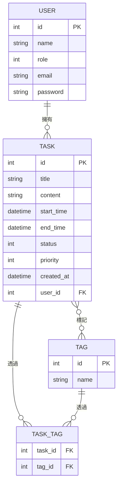

# jobmaster-backend README


Things you may want to cover:


## Development Environment

| tool | version |
|---|---|
| Ruby | **3.3.11** |
| Rails | **8.1.3.1** |
| PostgreSQL | **18.4** |


## Database Schema
 



## Usage

目前系統尚未有登入機制，所有功能皆可直接操作。

### Tasks

- `/tasks`：任務列表，預設以建立時間排序（`?sort=created_desc` 可切換為新到舊）
- `/tasks/new`：新增任務（`title` 必填，`content` 選填）
- `/tasks/:id/edit`：編輯任務
- 刪除任務：於列表頁對該筆任務執行刪除

### Users

- `/users`：使用者列表
- `/users/new`：新增使用者（`name`、`email`、`password` 必填；`email` 需符合格式且不可重複）
- `/users/:id/edit`：編輯使用者（更新時不需要重新輸入密碼）
- 刪除使用者：於列表頁對該筆使用者執行刪除
- 角色（`role`）僅能透過後台/資料庫直接設定，目前無法透過表單將自己改為 `adminstrator`

## Deployment

### Platform
 
- **App hosting**: [Render](https://render.com/) (Free plan, Deploy Manually)
- **Database**: [Neon](https://neon.tech/) (Free plan, PostgreSQL)

### Environment Variables (set on Render)
 
| Key | Description |
|---|---|
| `DATABASE_URL` | Neon PostgreSQL connection string |
| `RAILS_MASTER_KEY` | Decryption key for `config/credentials.yml.enc` (value from local `config/master.key`) |
| `RAILS_ENV` | Set to `production` |
| `WEB_CONCURRENCY` | Number of Puma workers (auto-configured by Render) |
 
### Build Command
 
```
bundle install; bundle exec rake assets:precompile; bundle exec rake assets:clean; bundle exec rails db:migrate;
```
 
### Start Command
 
```
bundle exec puma -t 5:5 -p ${PORT:-3000} -e production
```

### Deployment steps
 
1. 將變更 merge 到 `main` 分支
2. 進入 Render Dashboard → 你的 Web Service
3. 點擊 **Manual Deploy** → 選擇 **Deploy latest commit**
4. 在 **Logs** 分頁確認部署是否成功

### Live URL
 
[jobmaster-backend](https://jobmaster-backend-try.onrender.com/)

*免費方案 15 分鐘無流量會休眠，首次訪問需等待冷啟動*

 
## Docker
 
Dockerfile 已修正為 PostgreSQL 環境（`libpq5` / `libpq-dev`）。`PORT` 和 `EXPOSE` 的值依部署平台調整。


